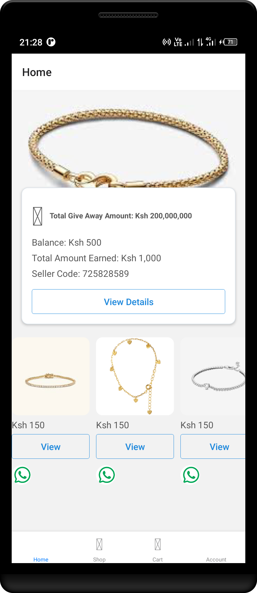
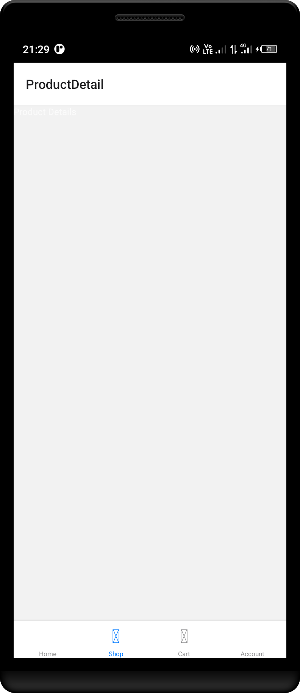
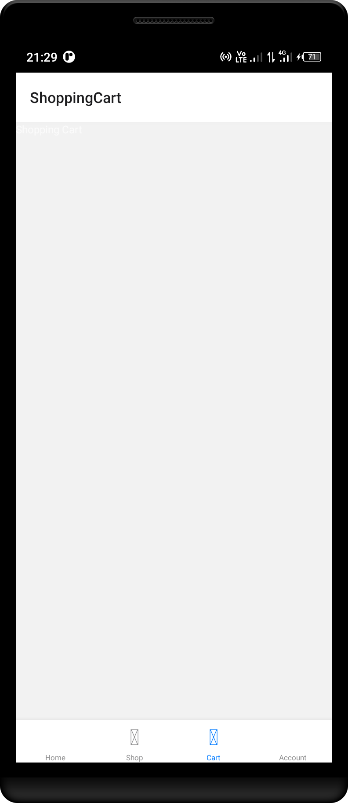

# Necklace Selling App

Introducing the Necklace Selling App, a React Native application designed to provide a seamless and enjoyable shopping experience for necklace enthusiasts. This app leverages the power of React Native to offer a smooth and intuitive user interface across both iOS and Android platforms.

## Features

- **Beautiful Product Display**: High-quality images and detailed descriptions of each necklace.
- **Cross-Platform Support**: Works seamlessly on both iOS and Android devices.
- **User-Friendly Interface**: Intuitive design for easy navigation and shopping.
- **Secure Checkout**: Safe and secure payment options for a worry-free shopping experience.

## Getting Started

To get started with the Necklace Selling App, follow these steps:

1. **Clone the Repository**: Clone this repository to your local machine.
2. **Install Dependencies**: Run `npm install` to install all necessary dependencies.
3. **Run the App**: Use `npx react-native run-android` or `npx react-native run-ios` to launch the app on your device or emulator.

## Technologies Used

- **React Native**: For building the cross-platform mobile application.
- **Redux**: For state management.
- **Firebase**: For backend services including authentication and database management.

## Contributing

We welcome contributions! Feel free to open issues, submit pull requests, or suggest improvements.

## License

This project is licensed under the MIT License. See the [LICENSE](LICENSE) file for more details.

Elevate your style with our Necklace Selling App! 📱💍